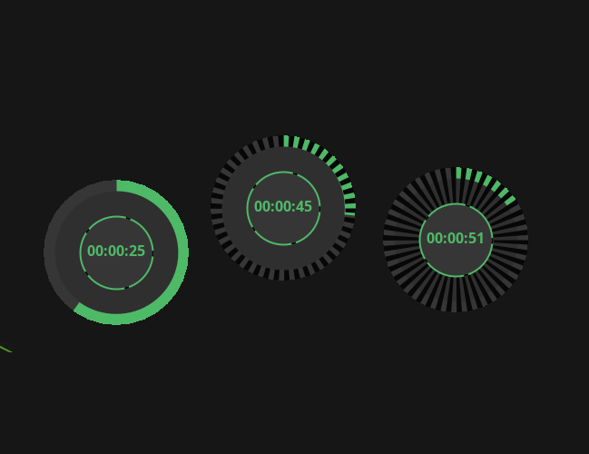

- [Introduction](#introduction)
- [Download](#download)

<h1 id="introduction">Just Focus</h1>

### A Distraction-Free Focus Timer for Linux Desktops

JustFocus is a minimalist and elegant desktop application designed to help you maintain focus during your work sessions.
Built with Java Swing, this unobtrusive timer sits cleanly on your desktop, providing clear visual feedback
without unnecessary distractions.

**Key Features:**

* **Minimalist Design:** A clean, undecorated circular UI that blends seamlessly with your desktop environment.
* **Visual Progress Indicator:** A smooth, animated arc visually represents the time remaining in your focus session,
  offering intuitive feedback at a glance.
* **Focus-Oriented:** Designed for dedicated work, JustFocus provides a fixed-duration timer (e.g., 30 minutes) without
  pause functionality, encouraging uninterrupted concentration.
* **Lightweight & Efficient:** Optimized for size and performance, making it a nimble addition to your workflow.

----

<h1 id="download">Download</h1>

### Windows installation

Download and install the
following [executable file](https://github.com/goto-eof/justfocus/releases/download/3.0.0/Just.Focus-3.0.0.exe).

### Linux Installation (Snap)

JustFocus is available as a Snap package for easy installation on most Linux distributions.

```bash
sudo snap install justfocus
```

### Linux Installation (dpkg)

It is possible to install Just Focus by downloading the
`.deb` [package](https://github.com/goto-eof/justfocus/releases/download/2.5.0/just-focus_2.5.0_amd64.deb) and by
installing it:

```bash
sudo dpkg -i just-focus_*.*.*_amd64.deb
```

In order to remove the application:

```bash
sudo apt-get remove just-focus
```

----

### Technologies

- Java (Swing)

### Contributing

Contributions are welcome! If you have suggestions for features, bug reports, or would like to contribute code, please
feel free to open an issue or pull request on the GitHub repository.

### Screenshot



### License

This project is licensed under
the [Creative Commons Attribution-NonCommercial-ShareAlike 4.0 International License](https://creativecommons.org/licenses/by-nc-sa/4.0/).

----

# Useful stuff

### Flickering

In order to avoid flickering on Ubuntu:

```bash
-Dsun.java2d.opengl=true -Dsun.java2d.xrender=true
```

### Build and execute the snap

```bash
sudo snap remove justfocus ; snapcraft clean; snapcraft; sudo snap install justfocus_*.*.*_amd64.snap --dangerous; justfocus
```

### Publish snap

```bash
snapcraft upload --release=stable justfocus_*.*.*_amd64.snap
```

### Build `.deb` package (Linux)

```bash
jpackage \
--type deb \
--name "Just Focus" \
--vendor "Andrei Dodu" \
--app-version "3.1.0" \
--input "target" \
--main-jar "just-focus.jar" \
--icon "icon.png" \
--main-class "com.andreidodu.Main" \
--dest "." \
--add-modules java.base,java.desktop \
--linux-shortcut \
--java-options "-Dsun.java2d.opengl=true -Dsun.java2d.xrender=true -Djdk.gtk.version=3" \
--verbose
```

### Build `.exe` file (Windows)

```bat
jpackage ^
--type exe ^
--name "Just Focus" ^
--vendor "Andrei Dodu" ^
--app-version "3.1.0" ^
--input "target" ^
--main-jar "just-focus.jar" ^
--icon "icon.ico" ^
--main-class "com.andreidodu.Main" ^
--dest "." ^
--add-modules java.base,java.desktop ^
--java-options "-Dsun.java2d.opengl=true -Dsun.java2d.xrender=true" ^
--verbose ^
--win-shortcut ^
--win-menu
```


